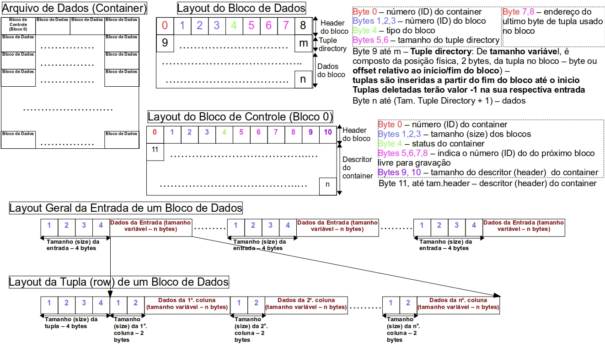

## Storage Engine implementação

> Sistema de armazenamento de arquivo para a cadeira de Implementação de banco de Dados 

#### Implementação:
* Gerenciador de Arquivo usando a Random Access File: 
* Buffer com politica de busca LRU
    
#### Tipo de dados a serem persistidos:
* Inteiros 
* String
* Porém o armazenamento é em byte array

Por simplicidade cada tabela persistida corresponderá a um arquivo físico:

#### Diagrama modelo do arquivo.

#### Gerenciador de arquivo
O gerenciador de arquivo deve prover os seguintes serviços:

* criar o arquivo 
* ler bloco 
* grava bloco(existente)
* criar bloco
* excluir bloco

#### Gerenciador de Buffet
Deve receber requisições das camadas superiores, com TupleIDs, e dai derivar o número do 
bloco requisitado (ID do bloco). Aplicando a politica, ele buscará em memória o bloco e,
se não encontrar, ele deve chamar o serviço do gerenciador de arquivo para ler o bloco
do arquivo. Após o bloco estar em memória, o gerenciador de buffer fornecerá o ID do 
bloco para que a camada superior possa processar a tupla no bloco. 
 

